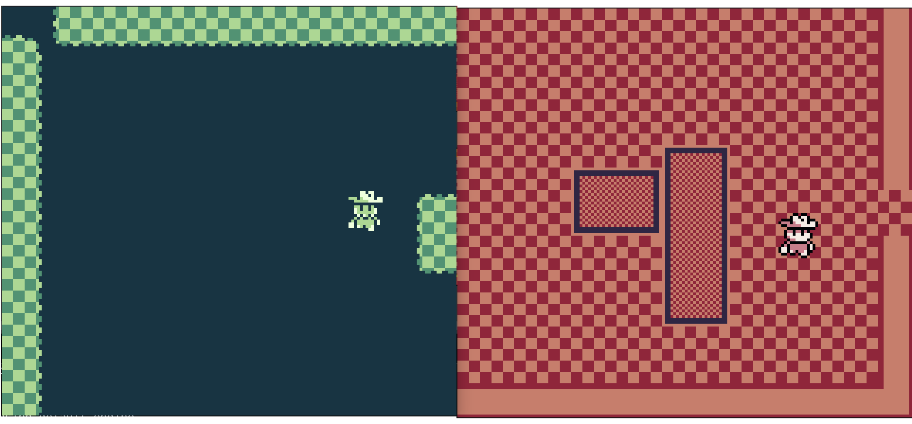

# Global-Game-Jam-2026
Project Repository for the KSU 2026 Global Game Jam

# Hardware
This project utilizes a implementation of the [Pico-GB project](https://github.com/YouMakeTech/Pico-GB) in order for us to showcase our game on near source hardware. For more information on schematics and modifications refer to the documentation

# Software Used
To make the game we are going to use [GB Studio](https://www.gbstudio.dev/) by Chris Maltby. This drag and drop (scratch-like) game engine will allow us to compile to the emulators format so that it can be run on the hardware we have availiable.

# Documentation
The source documentation, explaining all hardware and software processes is written in [typst](https://typst.app/), and provided in a precompiled PDF. All documentation, hardware and software, is provided in the documentation folder. PDF link is [here](./documentation/main.pdf).

# Our Game Premise (Veil of Dusk and Dawn)
*Veil of Dusk and Dawn* is a asymmetrical Co-Op multiplayer title meant to be ran on any hardware capable of gameboy emulation. You play as 1 man split across time as you attempt to return a magical mask back to it's rightful place, reuniting the timeline. One player is in the "Dusk" form, meaning he cannot see with the mask on, but can interact with the world, while in this form the player should be careful to not set off the alarms at every exhibit. To help in navigate, a second player named "Dawn" can see the world, but cannot interact with the world as in his timeline the mask is already returned. Dawn can use his vision to guide the Dusk player to returning the mask. 

# Images
